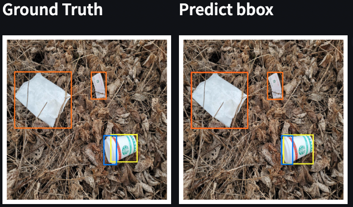
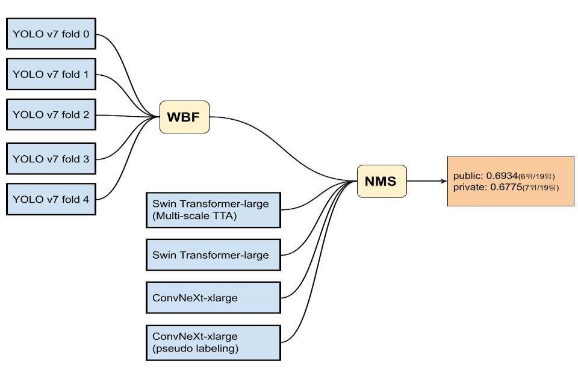

# BoostCamp AI Tech4 level-2-재활용 품목 분류를 위한 Object Detection Project
***
## Member🔥
| [김지훈](https://github.com/kzh3010) | [원준식](https://github.com/JSJSWON) | [송영섭](https://github.com/gih0109) | [허건혁](https://github.com/GeonHyeock) | [홍주영](https://github.com/archemist-hong) |
| :-: | :-: | :-: | :-: | :-: |
|  |  |  |  |  |
***
## Index
* [Project Summary](#Project-Summary)
* [Team role](#Team-role)
* [Procedures](#Procedures)
* [Model](#model)
* [Result](#result)
* [Command](#Command)
* [Wrap UP Report](#Wrap-UP-Report)  
***


## Project-Summary

### 개요
- 주제: 사진에서 쓰레기를 Detection 하는 모델을 만들어 **쓰레기로 인한 환경 문제를 해결**해보고자 합니다.
- 기대효과: 우수한 성능의 모델은 쓰레기장에 설치되어 **정확한 분리수거**를 돕거나, 어린아이들의 **분리수거 교육** 등에 사용될 수 있을 것입니다.
- Input: 쓰레기 객체가 담긴 이미지
- Output: bbox 좌표, category, score 값
### 데이터 셋 구조
- 이미지 크기 : (1024, 1024)
- annotation: COCO format
```
 dataset
    ├── train.json      
    ├── test.json
    ├── train            #(4,883장)
    └── test             #(4,871장)
```



|Class|Box|Class|Box|Class|Box|Class|Box|Class|Box|
|:---|:---|:---|:---|:---|:---|:---|:---|:---|:---|
|General_trash|<span style="background-color:rgb(255,0,0)">　　　</span>|Paper|<span style="background-color:rgb(255, 128, 0)">　　　</span>|Paper_pack|<span style="background-color:rgb(255, 255, 0)">　　　</span>|Metal|<span style="background-color:rgb(128, 255, 0)">　　　</span>|Glass|<span style="background-color:rgb(0, 255, 255)">　　　</span>|
|Plastic|<span style="background-color:rgb(0, 128, 255)">　　　</span>|Styrofoam|<span style="background-color:rgb(0, 0, 255)">　　　</span>|Plastic_bag|<span style="background-color:rgb(127, 0, 255)">　　　</span>|Battery|<span style="background-color:rgb(255, 0, 255)">　　　</span>|Clothing|<span style="background-color:rgb(128, 128, 128)">　　　</span>|
***

## Team role
- 김지훈: EDA, 2stage model 실험
- 원준식: backbone model 실험
- 송영섭: 대회 실험 관리 및 진행, 1stage model 실험
- 허건혁: Data EDA를 위한 시각화 tool 개발 & pseudo labeling 실험
- 홍주영: SOTA모델(Diffusion Det) 적용, 2-stage model 실험
---

## Procedures
대회 기간 : 2022.11.16 ~ 2022.12.01

| 날짜 | 내용 |
| :---: | :---: |
| 11.14 ~ 11.20 | BoostCamp 강의 수강 및 Object Detection 이론 학습|
| 11.21 ~ 11.27 | Data EDA & Model Experiment |
| 11.28 ~ 12.01 | HyperParameter Tuning & model Ensemble |
---
## Model

### 1 stage model

- 1 stage model 은 mmdetection 및 yolov7 라이브러리에 구현된 모델들 중 주어진 데이터에 가장 높은 성능을 내는 **YOLOv7 선정**

| Model | mAP50 (val) | mAP50 (LB) | Training Time | Inference Time |
| :---: | :---: | :---: | :---: | :---: |
| YOLOv3 | 22.1 | 39.51 | 3h 34m 28s | 1m 30s |
| YOLOX | 20.4  | - | 16h  | 94s |
| YOLOv7 | 56.2 | 44.76 | 6h 16m  | 약 5m |
| SSD | 47.6 | - | 6h 50m 41s | 54s |

### 2 stage

- 2 stage model 은 mmdetection, detectron2 라이브러리로 구현된 모델과 backborn 의 조합 중 주어진 데이터에 시간 대비 가장 높은 성능을 **Cascade-RCNN**을 최종 모델로 선정

| Model | mAP50 (val) | mAP50 (LB) | Training Time | Inference Time (validation) |
| :---: | :---: | :---: | :---: | :---: |
| VariFocalNet | 52.8 | 50.6 | 7h 00m 7s | 102s |
| TOOD | 48.5 | 42.3 | 6h 35m 59s | 136s |
| Deformable-DETR | 42.1 |  | 13h 39m 15s | 98s |
| Cascade-RCNN | 48.9 |  | 1h 43m 11s | 75s |

### Backbone

- mmdetection 라이브러리에 구현된 백본 및 평가 지표를 근거로 학습시간과 팀원들의 모델과의 앙상블, 모델 사이즈의 확장성을 고려하여 **swin-transformer**와 **ConvNeXt**를 최종 backbone으로 결정

**Model type: Cascade RCNN** 

| Backbone | mAP50 (val) | mAP50 (LB) | Training Time | Inference Time(validation) |
| --- | --- | --- | --- | --- |
| ResNeSt | 52.6 |  | 3h 10m 2s | 161s |
| ResNet strikes back | 52.5 |  | 1h 42m 3s | 66s |
| Swin-tiny | 51.9 |  | 2h 54m 1s | 112s |
| ConvNeXt-tiny | 50.3 |  | 2h 30m 2s | 103s |
| PVT | 56.1 |  | 3h 34m 46s | 152s |

### Augmentation

모델에 따라 효과적인 augmentation을 각각 적용

- **Normalizaion**
- **base_augmentation**
    - Horizontal, Vertical Flip, GaussNoise, Shiftscale Rotate, RandomBrightnessContrast, RGB Shift, HueSaturationValue, Blur, Median Blur
- **Mosaic (p=0.5)**
- **Mixup (p=0.5)**

### Optimization


- **SGD**
- **AdamW**
- **Adam with no weight decay**
- **Cosine Annealing scheduler**

### TestTimeAugmentation

- **Multi-scale TestTimeAugmentation** 적용 (512, 512) ~ (1024, 1024)까지 (128, 128) 씩 증가시켜 적용

|  | LB Score | Inference Time |
| --- | --- | --- |
| Swin-Large without multi-scale TTA | 0.6132 | 2225s |
| Swin-Large with multi-scale TTA | 0.6317 | 6901s |

### Ensemble



---
## Result
| Leaderboard | public | private |
| :---: | :---: | :---: |
| Score(mAP50) | 0.6934 | 0.6775 |
| Ranking | 6th / 19th | 7th / 19th |

## Command
- mmdetection train command
```
python mmdetection/tools/train.py {config file}
```

- submission csv 생성 command

```
python submission.py -c {config file} -r {checkpoint}
```

- Data Visual을 위한 streamlit command
```
streamlit run app.py
```


---
## Wrap UP Report
- [Report](https://drive.google.com/file/d/1auQykRDcY0QVa-IHlWF9wDirwZ19LalL/view?usp=share_link)

